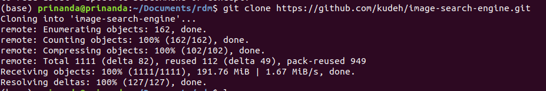
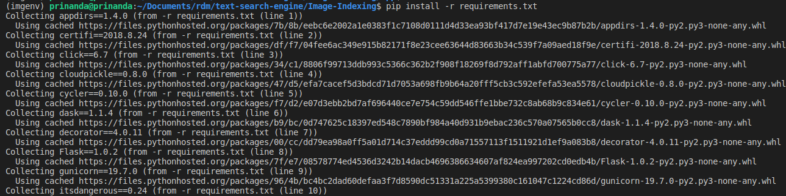
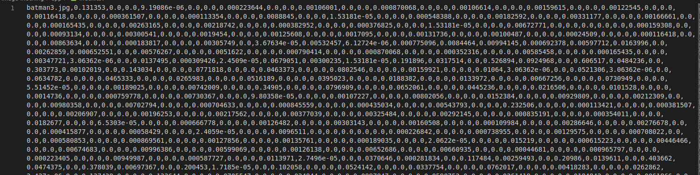

# Image Indexing
Operating System : Ubuntu 18.04.3 LTS

Library dijalankan di Anaconda3 Distribution dan Python versi 3.7.3

## Petunjuk Penggunaan
1. Clone repository menggunakan perintah pada CLI :
    ```bash
    $ git clone https://github.com/kudeh/image-search-engine.git
    ```
    
    
2. Masuk ke direktori hasil clone menggunakan perintah CLI:
    ```bash
    $ cd image-search-engine
    ```
3. Cek apakah **pip** sudah terinstall
    ```bash
    $ pip
    ```

4. Jika sudah, jalankan perintah berikut untuk install requirement :
    ```bash
    $ pip install -r requirements.txt
    ```

    

    Jika belum, install pip terlebih dahulu :
    ```bash
    $ sudo apt install python-pip
    ```

5. Kemudian masuk ke dalam direktori **app**
    ```bash
    $ cd app
    ```
6. Kita bisa mengubah dataset yang awalnya ada pada **static/images** menjadi **photo**

7. Jalankan image indexing dengan perintah berikut :
    ```bash
    $ python3 index.py --dataset photo --index index.csv
    ```

    Hasil dari image indexing yaitu pada file **index.csv** seperti gambar berikut ini :
    


Library source : [image-search-engine](https://github.com/kudeh/image-search-engine.git)
