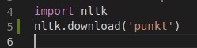
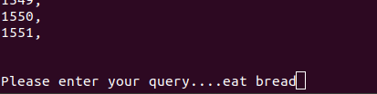
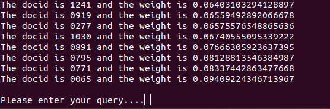

# Text Indexing
Operating System : Ubuntu 18.04.3 LTS

Library dijalankan di Anaconda3 Distribution dan Python versi 3.7.3

## Petunjuk Penggunaan
1. Clone repository menggunakan perintah pada CLI :
    ```bash
    $ git clone https://github.com/nilayjain/text-search-engine.git
    ```
    
    
2. Masuk ke direktori hasil clone menggunakan perintah CLI:
    ```bash
    $ cd text-search engine
    ```
3. Jalankan program
    ```bash
    $ python ir.py
    ```

4. Besar kemungkinan ketika program dijalankan akan muncul error seperti pada gambar berikut : 

    

5. Buka file **ir.py** menggunakan text editor. Kemudian tambahkan **nltk.download("punkt")** di bawah code **import nltk** seperti pada gambar berikut :

    

6. Kemudian ubah perintah untuk menginput dari raw_input (python2) menjadi input (python3), seperti pada gambar berikut :

    

7. Kemudian jalankan kembali program dan berikut hasilnya :
    ```bash
    $ python ir.py
    ```
    

8. Kita dapat melakukan pencarian kata-kata seperti pada gambar berikut :

    

9. Jika ingin mengubah dokumen yang akan diindexing, kita dapat membuka folder **corpus** yang merupakan **dataset**.
10. Kita juga dapat mengubah folder dataset menjadi yang lain dengan mengubah nama folder pada function **get_document_text_from_doc_id** pada file **ir.py**

Library source : [text-search-engine](https://github.com/nilayjain/text-search-engine.git)
